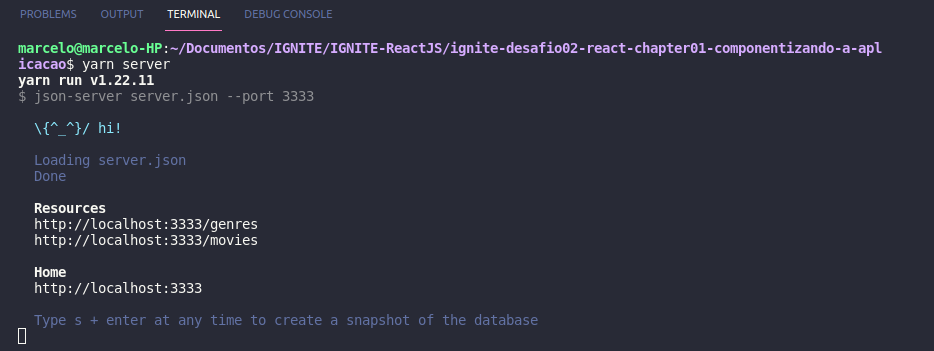
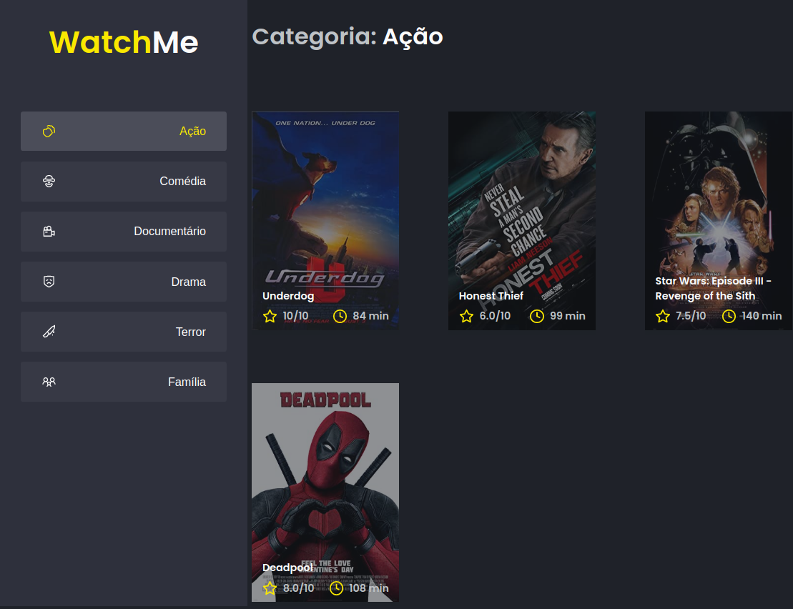
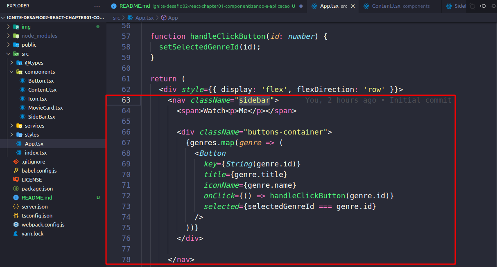
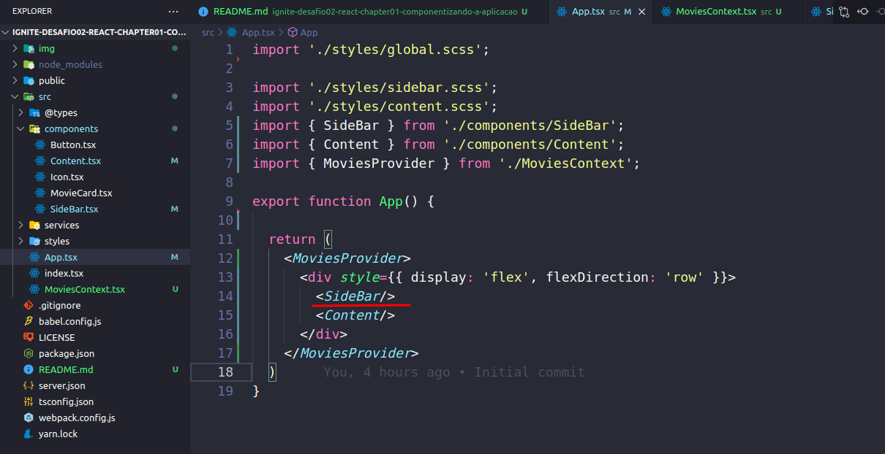
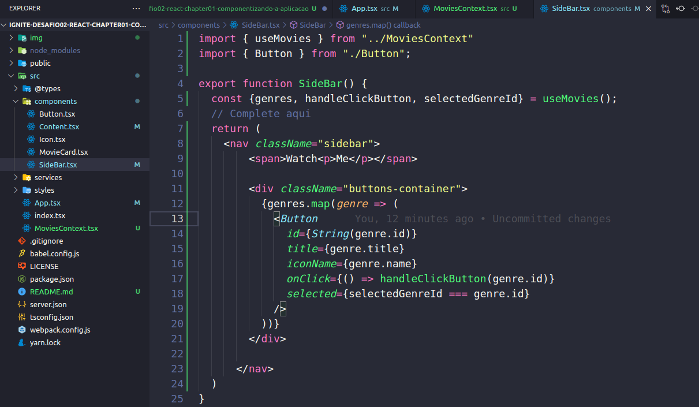
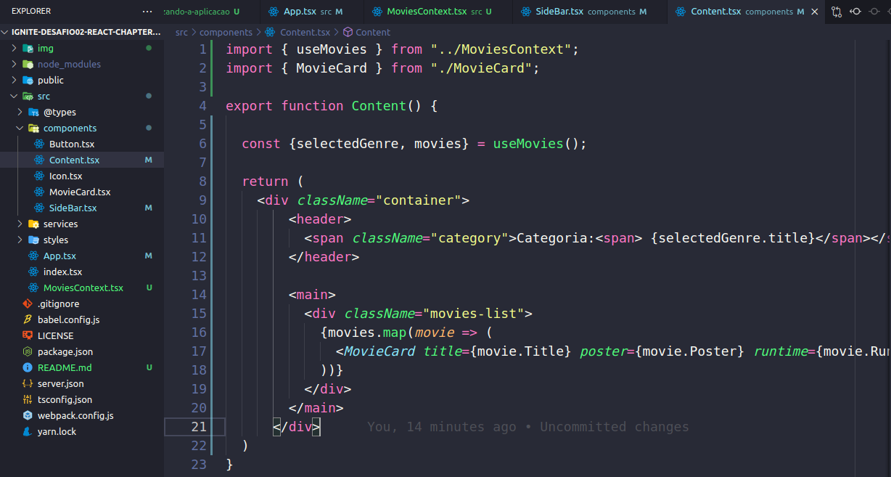
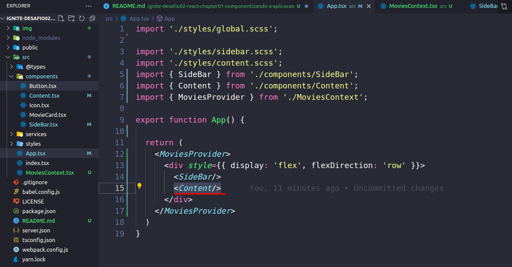
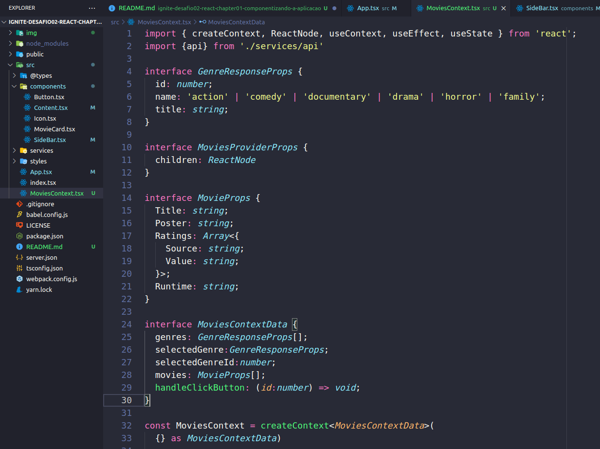
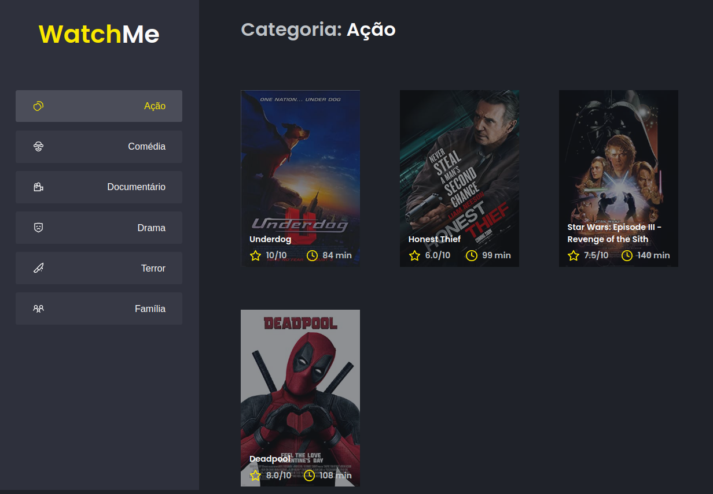

<h1 align="center">
  
</h1>

# ignite-desafio02-react-chapter01-componentizando-a-aplicacao

## Desafio 02 - Componentizando a Aplicação


Vamos inicia digitando yarn:
`yarn`

Agora digitamos:
`yarn server`

<h1 align="center">
  
</h1>

Perceba que ele iniciou uma fake API com os recursos 
/genres 
/movies 
em localhost na porta 3333 a partir das informações do arquivo `server.json` localizado na raiz do seu projeto. 

Agora vamos rodar a aplicação:
`yarn dev`

E digita no Browser o caminho:
`localhost:8080`

<h1 align="center">
  
</h1>

Os dois principal componentes:

src/components/SideBar.tsx

Vamos pega a SideBar no arquivo `App.tsx`
Observe que em cima ele ja da as impotações comentadas.

<h1 align="center">
  
</h1>

E no lugar precisamos chamar a SideBar vamos adicionar `<SideBar/>`.

<h1 align="center">
  
</h1>

Recorta e colar no arquivo `SideBar.tsx` dentro do return

<h1 align="center">
  
</h1>

src/components/Content.tsx

Vamos pega a Content no arquivo `App.tsx`

Recorta e colar no arquivo `Content.tsx` dentro do return

<h1 align="center">
  
</h1>

E no lugar precisamos chamar a Content vamos adicionar `<Content/>`.

<h1 align="center">
  
</h1>

Agora vamos criar um arquivo `MoviesContext.tsx` e recorta o restante do codigo do arquivo `App.tsx`.

<h1 align="center">
  
</h1>

O codigo fica assim:

```
import { createContext, ReactNode, useContext, useEffect, useState } from 'react';
import {api} from './services/api'

interface GenreResponseProps {
  id: number;
  name: 'action' | 'comedy' | 'documentary' | 'drama' | 'horror' | 'family';
  title: string;
}

interface MoviesProviderProps {
  children: ReactNode
}

interface MovieProps {
  Title: string;
  Poster: string;
  Ratings: Array<{
    Source: string;
    Value: string;
  }>;
  Runtime: string;
}

interface MoviesContextData {
  genres: GenreResponseProps[];
  selectedGenre:GenreResponseProps;
  selectedGenreId:number;
  movies: MovieProps[];
  handleClickButton: (id:number) => void;
}

const MoviesContext = createContext<MoviesContextData>(
  {} as MoviesContextData)

export function MoviesProvider({children}: MoviesProviderProps) {
  const [selectedGenreId, setSelectedGenreId] = useState(1);

  const [genres, setGenres] = useState<GenreResponseProps[]>([]);

  const [movies, setMovies] = useState<MovieProps[]>([]);
  const [selectedGenre, setSelectedGenre] = useState<GenreResponseProps>({} as GenreResponseProps);

  useEffect(() => {
    api.get<GenreResponseProps[]>('genres').then(response => {
      setGenres(response.data);
    });
  }, []);

  useEffect(() => {
    api.get<MovieProps[]>(`movies/?Genre_id=${selectedGenreId}`).then(response => {
      setMovies(response.data);
    });

    api.get<GenreResponseProps>(`genres/${selectedGenreId}`).then(response => {
      setSelectedGenre(response.data);
    })
  }, [selectedGenreId]);

  function handleClickButton(id: number) {
    setSelectedGenreId(id);
  }

  return (
    <MoviesContext.Provider value={{genres, selectedGenreId, selectedGenre, handleClickButton, movies}}>
      {children}
    </MoviesContext.Provider>
  )
}

export function useMovies() {
  const context = useContext(MoviesContext);

  return context
}
```

<h1 align="center">
  
</h1>


Link: 
https://www.notion.so/Desafio-02-Componentizando-a-aplica-o-b9f0f025c95b437699d0c3115f55b0f1#1149f59c73454366bee35268d553150e